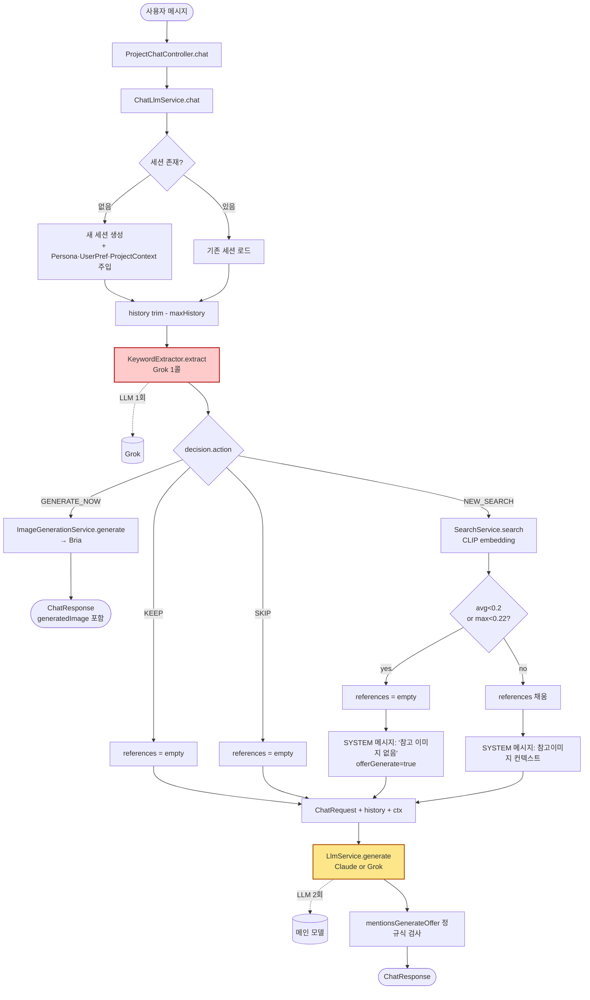
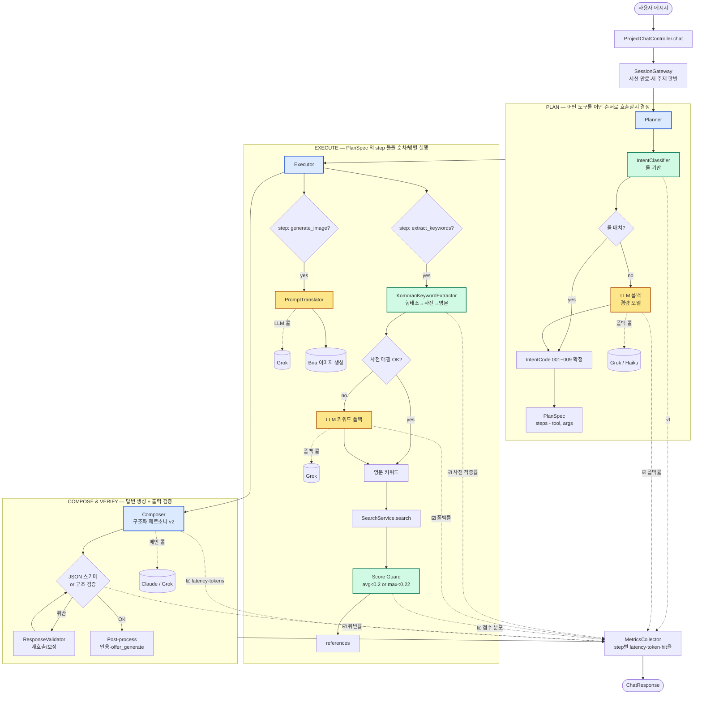
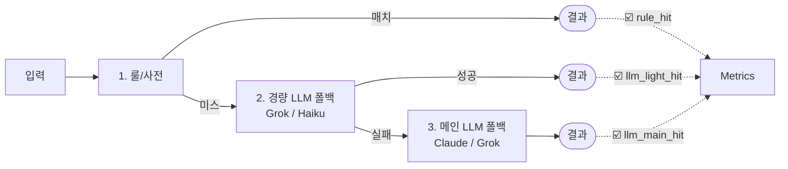

# LLM 파이프라인 — Flow Chart

> 작성일: 2026-05-22
> 짝 문서: [`docs/decisions/AI-feedback-action-plan.md`](../decisions/AI-feedback-action-plan.md)
> 목적: 강사님 피드백 #9 "쿼리 입력 → 처리 흐름을 도식화하고 그 위에서 로직 구현"
>
> 두 장의 다이어그램으로 구성한다:
> 1. **현재 (As-Is)** — 지금 코드가 하는 일. LLM 한 콜로 분류·키워드 추출을 묶고 있다.
> 2. **목표 (To-Be)** — Planning Agent 구조. 룰 베이스 분류 → 형태소 키워드 → step 별 LLM 콜.
>
> 모든 분기점에는 [Phase 1] 에서 정의할 **Intent Code** (001~009) 를 적어 둔다.
> 메트릭 수집 지점은 ☑️ 로 표시한다 — [Phase 5] 에서 정량 평가가 가능하도록 한다.

---

## 1. As-Is — 현재 파이프라인

### As-Is 의 문제 (피드백과 매핑)

| 지점 | 문제 | 피드백 # |
|------|------|---------|
| `KeywordExtractor.extract` | 한 LLM 콜이 4-way 분류 + 영문 키워드 추출까지 동시에 함 → 같은 입력에 다른 결과 | #1, #2, #5 |
| 키워드 출력 형식 `NEW_SEARCH: ...` | 자연어 규약 — 파싱 실패 시 SKIP 폴백 | #2 |
| 한글 형태소 미처리 | 조사·어미 포함된 키워드가 그대로 LLM 에 전달 → 키워드 품질 저하 | #6, #8 |
| 세션 종료 트리거 없음 | 시간 경과·주제 변경 없이 같은 세션이 누적됨 | #7 |
| 단일 페르소나 string | 출력 포맷·길이 검증 없음 | #2 |

---

## 2. To-Be — Planning Agent 파이프라인

### To-Be 의 핵심 변화

1. **PLAN / EXECUTE / VERIFY 분리** — Planning Agent 의 기본 골격. 추론(chain-of-thought) 없이, 단순 콜을 단계로 쪼개기 (피드백 #3).
2. **룰 베이스 우선 + LLM 폴백** — IntentClassifier·KeywordExtractor 모두 룰 → 사전 → LLM 순. 폴백률 자체를 메트릭으로 (피드백 #1, #5, #6, #8).
3. **출력 검증 레이어** — ResponseValidator 가 페르소나 v2 의 구조(`[핵심 조언]→[참고 이미지 인용]→[다음 단계 제안]`)를 검사하고 위반 시 재호출 (피드백 #2).
4. **세션 게이트웨이** — 만료·주제 변경 판별 후 PLAN 진입. 세션 메타데이터를 모든 step 콜에 부착해 로그 분석 가능 (피드백 #7).
5. **MetricsCollector** — 모든 분기에 ☑️ 표시. 정량 평가 (피드백 #4).

---

## 3. Intent Code 라우팅 표 (PLAN → EXECUTE 매핑)

PlanSpec 이 어떤 step 시퀀스를 생성하는지의 기본 라우팅. [Phase 1] 의 `IntentCode` enum 과 일치한다.

| Code | 의미 | 기본 step 시퀀스 |
|------|------|-----------------|
| `001` | 구도 분석 | `compose(persona=composition)` |
| `002` | 빛/명암 분석 | `compose(persona=light)` |
| `003` | 색감/색상 조언 | `compose(persona=color)` |
| `004` | 기법 질문 | `compose(persona=technique)` |
| `005` | 새 레퍼런스 요청 (NEW_SEARCH) | `extract_keywords → search → compose` |
| `006` | 기존 레퍼런스 유지 / 세부 질문 (KEEP) | `compose(use_previous_refs=true)` |
| `007` | 잡담/감사 (SKIP) | `compose(no_refs=true, persona=brief)` |
| `008` | AI 이미지 생성 요청 | `translate → generate_image` |
| `009` | [N]번 이미지 참조 | `resolve_anchor → (005 or 006 or 008)` |

> `009` 는 단독으로 끝나지 않고 다른 코드로 위임된다. PlanSpec 이 sub-plan 을 만든다.

---

## 4. 폴백 우선순위 정책

각 LLM 콜은 **세 단계 폴백** 을 거치며, 가장 비싼 단계에 도달한 비율을 메트릭으로 본다.

**SLO 초안 (Phase 5 에서 수치 확정):**
- IntentClassifier 룰 적중률 ≥ **70 %**
- KeywordExtractor 사전 적중률 ≥ **60 %**
- 메인 LLM 폴백률 ≤ **5 %**

---

## 5. 다음 다이어그램 (TODO — 후속 PR)

- SessionGateway 의 세션 분리 규칙 시퀀스 다이어그램 (Phase 6)
- ResponseValidator 의 재시도 루프 상세 (Phase 3)
- MetricsCollector 가 쓰는 메트릭 스키마 ERD (Phase 5)
