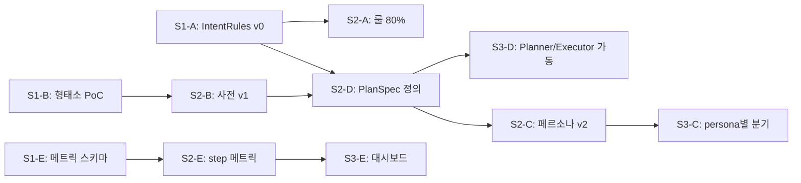

# AI 강사님 피드백 — 정리 및 진행 방향

> 작성일: 2026-05-20
> 범위: `domain/llm` (KeywordExtractor, ChatLlmService, PromptTranslator 등) 및 검색·이미지 생성 파이프라인

---

## 1. 강사님 피드백 요약

| # | 피드백 | 핵심 메시지 |
|---|--------|------------|
| 1 | LLM 의존 과다 | LLM이 모든 판단을 내리는 구조에서 벗어나야 한다. |
| 2 | 일관성 부족 | system 프롬프트로 규격화. 출력 포맷을 강제할 방법을 찾아라. |
| 3 | ReAct 도입 | 좋은 방향이지만 비용·지연이 크다. 추론 없이 LLM 다중 호출로 대체 가능. |
| 4 | 데이터 정량화 | 평가·로깅 데이터를 수치로 정량화하라. |
| 5 | Intent 분류 | case 코드로 규칙화 — 구도=001, 빛=002 식으로 사례를 코드로 매핑. |
| 6 | 검색어 추출 | 형태소 분석·조사 제거 등 NLP 전처리가 필요. |
| 7 | 세션 구분 | 세션 분리 기준을 명확히 정해서 컨텍스트에 주입. |
| 8 | 룰 베이스 + 토크나이제이션 | 적절한 NLP/룰 기반 툴을 구성하라. |
| 9 | Flow Chart | 쿼리 입력 → 처리 흐름을 도식화하고 그 위에서 로직 구현. |
| 10 | 부하 | LB(로드밸런서) 영역. 애플리케이션 레벨에서 신경 쓰지 말 것. |
| 11 | SVG 레이어 | SVG 생성은 품질이 안 나옴. 벡터 README 등이 더 적합. |
| 12 | Spring AI vs LangGraph | Spring AI는 제약이 많다. LangGraph가 낫다. |
| 13 | 이미지 API 학습 | 우리가 "생성 모델 학습"이 아니라 "API 호출"이므로 사용 OK. |
| 14 | 사용자 행동 데이터 | 비영리 목적이면 가능. 단 **Google Form 등으로 명시적 동의를 반드시 받을 것**. |

---

## 2. 핵심 문제 진단

### 2.1 현재 구조의 한계

```
사용자 메시지
  └─ KeywordExtractor.extract()  ← LLM이 NEW_SEARCH / KEEP / SKIP 분류
       └─ SearchService.search() ← CLIP 임베딩
            └─ ChatLlmService.chat()  ← LLM이 최종 답변
```

- intent 분류조차 LLM에 의존 → 같은 입력에 다른 결과(일관성 0)
- 키워드 추출도 LLM 의존 → 영어 번역까지 LLM 1콜 소비
- 조사·어미 처리 없이 raw 한글이 그대로 검색으로 흘러감
- 출력 포맷이 자연어 규약(`NEW_SEARCH: ...`)이라 파싱 실패 시 SKIP 폴백

### 2.2 강사님 진단과 일치하는 부분
- 피드백 1, 2, 6: 모두 위 한계와 직결.
- 피드백 5: intent를 코드(001/002…)로 매핑하면 일관성 + 로깅·통계화 동시 해결.

---

## 3. 진행 방향 (우선순위 순)

### Phase 1 — 룰 기반 Intent 분류기 도입 (선결 작업)

**목적**: LLM 콜 1회 절감 + 일관성 확보 + 정량 평가 가능

**할 일**
1. Intent 코드 체계 정의
   - `001` 구도 분석
   - `002` 빛/명암 분석
   - `003` 색감/색상 조언
   - `004` 기법(수채화/유화/디지털) 질문
   - `005` 새 레퍼런스 요청 (NEW_SEARCH)
   - `006` 기존 레퍼런스 유지 / 세부 질문 (KEEP)
   - `007` 잡담/감사 (SKIP)
   - `008` AI 이미지 생성 요청
   - `009` [N]번 이미지 참조
2. 각 코드에 대해 **룰 + 키워드 사전** 작성
   - 예: `005` ⇐ {"다른 거", "더 보여줘", "또", "another", "more"}
   - 예: `009` ⇐ 정규식 `\\[?\\d+\\]?번` + 컨텍스트 키워드 ("같은", "비슷한", "처럼")
3. 룰로 판별 안 되는 경우만 LLM 폴백 → 폴백 비율을 메트릭으로 수집
4. `KeywordExtractor.java` → `IntentClassifier` + `KeywordExtractor` 로 분리

**산출물**: `IntentCode` enum, `IntentRules.json`, `IntentClassifier.java`, 테스트 케이스 100개

---

### Phase 2 — 형태소 분석 기반 키워드 추출

**목적**: LLM 없이 한글 키워드 → 영문 검색어 변환

**할 일**
1. 한국어 형태소 분석기 도입
   - 후보: **Komoran** (Java 네이티브, 사전 추가 쉬움) / Nori (Lucene 내장)
   - 결정 기준: 그림·미술 도메인 사전 추가 용이성
2. 처리 파이프라인
   ```
   원문 → 형태소 분석 → 명사·형용사만 추출
         → 조사·어미 제거 → 도메인 사전 매핑 (한→영)
         → 검색어 생성
   ```
3. 도메인 사전 (`art-terms-ko-en.csv`) 구축
   - 1차: 우리 시드 이미지의 `technique/subject/mood` 태그 기반
   - 2차: 사용자 로그에서 미매핑 단어를 주기적으로 수집
4. LLM 키워드 추출은 **사전 미스 비율 > 30%일 때만** 폴백

**산출물**: 형태소 분석 의존성, `KeywordExtractor` 재구현, 도메인 사전 CSV

---

### Phase 3 — System 프롬프트 규격화

**목적**: LLM이 마지막 자연어 답변을 만들 때라도 일관된 포맷·톤 강제

**할 일**
1. `PersonaRegistry`에 **구조화된 응답 템플릿** 추가
   - 답변 구성: `[핵심 조언]` → `[참고 이미지 인용]` → `[다음 단계 제안]`
   - 길이 제한, 인용 형식, 금지 표현 명시
2. JSON 출력 모드를 지원하는 콜에는 JSON 스키마로 강제
3. 페르소나별 출력 검증기(`ResponseValidator`)
   - 위반 시 재호출 또는 보정
4. 출력 일관성 메트릭
   - 같은 입력 5회 호출 → 핵심 키워드 일치율을 측정

**산출물**: 페르소나 v2 프롬프트, `ResponseValidator`, 일관성 회귀 테스트

---

### Phase 4 — Multi-Call (ReAct 없이 다단계 LLM)

**목적**: 추론 비용 없이 품질 향상

**할 일**
- 한 번에 모든 걸 시키지 말고 **단순 호출을 단계로 쪼개기**
  1. 콜 A: intent 분류 (룰 폴백용 — 가벼운 모델)
  2. 콜 B: 키워드 정제 (사전 미스 시만)
  3. 콜 C: 최종 답변 생성 (메인 모델)
- 각 콜은 **결과를 명시적으로 다음 콜에 주입**. 추론 chain-of-thought 없음.
- 콜별 모델 라우팅: A·B는 Grok / Haiku, C는 사용자 플랜에 따라.

**산출물**: `ChatLlmService.chat()` 단계화, 콜별 latency·token 로깅

---

### Phase 5 — 정량 평가 기반 구축

**목적**: 피드백 4 — "데이터를 정량화"

**할 일**
1. 메트릭 수집 (`SearchLogService` 확장)
   - intent 분류 정확도 (룰 vs LLM 폴백 일치율)
   - 키워드 추출 사전 적중률
   - 검색 평균/최대/최소 점수 (이미 수집 중 — 유지)
   - 답변 일관성 점수 (Phase 3)
   - LLM 콜 횟수·토큰·비용 per 세션
2. 대시보드
   - 1차: 로그 + 간단 집계 쿼리
   - 2차: Grafana 등 (필요 시 — 부하/모니터링은 우선순위 낮음)
3. **사용자 행동 데이터 동의 (강사님 강조)**
   - Google Form 또는 회원가입 시 동의 체크박스 추가
   - 문구 예시: "서비스 품질 개선을 위해 채팅·검색 행동 데이터가 익명화되어 수집·분석되는 데 동의합니다."
   - 동의하지 않은 사용자 데이터는 **메트릭 집계에서 제외**

**산출물**: 메트릭 테이블 스키마, 동의 플로우, 일일 집계 잡

---

### Phase 6 — 세션 구분 정책 명확화

**목적**: 피드백 7

**현재**: `ChatSession`은 프로젝트당 다수 가능하지만, 세션 종료 트리거가 없음.

**할 일**
- 세션 분리 기준 정의:
  - 마지막 메시지 후 N시간 경과 → 새 세션
  - 사용자가 명시적 "새 대화" 클릭
  - 프로젝트 컨텍스트가 변경되면 새 세션
- 각 세션 시작 시 "이 세션의 목적" 한 줄을 SYSTEM 메시지로 자동 주입
- 세션 ID + 프로젝트 컨텍스트를 **모든 LLM 콜의 metadata에 포함** → 로그 분석용

---

### Phase 7 — Flow Chart 작성 (병행)

**목적**: 피드백 9 — 흐름을 시각화해야 로직이 보인다.

**할 일**
- 다이어그램 도구: Mermaid (md에 그대로 들어감 → 벡터형, 강사님이 말한 "벡터 README" 컨셉과 일치)
- 그릴 흐름:
  1. 메시지 진입 → 세션 결정
  2. Intent 분류 (룰 → LLM 폴백)
  3. 키워드 추출 (형태소 → 사전 → LLM 폴백)
  4. 검색 → 점수 안전장치 → references / offer_generate
  5. 최종 답변 생성
  6. 응답 + 로깅
- 모든 분기점에 **결정 코드**(001~009)와 폴백 경로 명시

**산출물**: `docs/architecture/llm-flow.md` (Mermaid)

---

## 4. 명시적으로 **하지 않을 것**

| 항목 | 이유 |
|------|------|
| ReAct 풀 도입 | 강사님 — 비용·지연 큼. Multi-call (Phase 4)로 대체. |
| Spring AI 본격 도입 | 강사님 — 제약 많음. 현재 직접 호출 구조 유지. LangGraph는 우리 스택(Spring Boot)과 맞지 않으므로 **개념만 참고**. |
| SVG 레이어 생성 | 강사님 — SVG 품질 안 나옴. 현재 Bria 이미지 생성 유지. |
| 애플리케이션 레벨 부하 분산 | 강사님 — LB 영역. 운영 단계에서 처리. |
| 사용자 데이터 영리 활용 | 강사님 — 동의 필수, 비영리 목적만. |

---

## 5. 즉시 착수 (이번 주)

- [ ] Phase 1 — Intent 코드 enum + 룰 JSON 1차 작성, `KeywordExtractor`에서 룰 분기 추가
- [ ] Phase 7 — Mermaid Flow Chart 1차 작성 (현재 구조 먼저, 그 위에 Phase 1~6 표시)
- [ ] Phase 5 — Google Form 동의 문구 초안 작성 → 강사님 컨펌

## 6. 다음 스프린트

- Phase 2 (형태소 분석)
- Phase 3 (응답 규격화)

## 7. 백로그

- Phase 4 (Multi-call 단계화)
- Phase 5 (메트릭 대시보드)
- Phase 6 (세션 정책 정교화)

---

## 8. 스프린트 실행 계획 (2주 단위, 팀 병렬)

> 추가 결정: **Planning Agent** 로 향후 확장한다. Phase 4 의 "Multi-call" 은 단순 호출 분할이 아니라 **Plan → Execute → Verify** 구조로 격상한다. Phase 1 의 Intent Code 는 Planner 의 라우팅 키, Phase 5 의 메트릭은 step 별로 수집한다.
>
> 자세한 흐름: [`docs/architecture/llm-flow.md`](../architecture/llm-flow.md)

### 8.1 트랙 분리 (병렬 작업 단위)

| 트랙 | 책임 영역 | Phase 매핑 |
|------|----------|-----------|
| **A — Intent/룰** | IntentCode enum, IntentRules.json, IntentClassifier, 룰 회귀 테스트 | Phase 1, 7 |
| **B — NLP/사전** | 형태소 분석기 도입, 도메인 사전, KeywordExtractor 재구현 | Phase 2 |
| **C — Composer/검증** | 페르소나 v2, ResponseValidator, JSON 스키마 출력 | Phase 3 |
| **D — Agent 뼈대** | Planner / Executor / PlanSpec 인터페이스, 기존 chat() 을 Agent 위로 리팩토링 | Phase 4 (격상) |
| **E — 메트릭/동의** | 메트릭 스키마, MetricsCollector, Google Form 동의 플로우 | Phase 5 |
| **F — 세션** | SessionGateway, 만료 정책, 세션 메타 주입 | Phase 6 |

> 트랙 A·B·E 는 거의 독립이라 **S1 동시 착수 가능**. 트랙 C·D 는 A·B 의 인터페이스를 본 뒤 S2 진입.

### 8.2 스프린트 일정

#### S1 (현재 ~ +2주) — "측정 가능한 룰 베이스 뼈대"

| 트랙 | DoD (Definition of Done) |
|------|--------------------------|
| A | `IntentCode` enum + `IntentRules.json` (코드 001~009 각 5개 이상 룰), `IntentClassifier.classify()` 메서드, JUnit 100케이스 — **룰 적중률 ≥ 70 % 로그**가 찍힌다. `KeywordExtractor` 는 그대로 두되 IntentClassifier 가 룰 매치 시 LLM 콜 스킵. |
| B | Komoran / Nori PoC 비교 노트, 도메인 사전 v0 (`art-terms-ko-en.csv` 50행 이상), 기존 `ChatRequest` 메시지 → 명사·형용사 추출까지만 동작. **아직 검색에는 연결하지 않음.** |
| E | 메트릭 테이블 스키마 마이그레이션 (`intent_classification_log`, `keyword_extraction_log`), Google Form 동의 문구 초안 작성 → 강사님 컨펌. |
| F | 세션 만료 규칙 문서화 (코드 변경 없음). |

**S1 종료 시점에 측정 가능한 것:**
- IntentClassifier 룰 적중률 (실사용자 데이터)
- 사용자별 메시지 길이·세션 길이·일일 콜 수

#### S2 (+2주 ~ +4주) — "비용 절감 + 출력 규격화"

| 트랙 | DoD |
|------|------|
| A | LLM 폴백 케이스 분석 → 룰·사전 보강, 룰 적중률 80 % 도달. |
| B | 도메인 사전 v1 (200 행), `KomoranKeywordExtractor` 가 `005` (NEW_SEARCH) step 에서 LLM 대신 사용됨. **사전 적중률 ≥ 60 %** 측정. |
| C | 페르소나 v2 도입 — `[핵심 조언] → [참고 이미지 인용] → [다음 단계 제안]` 구조. `ResponseValidator` 가 위반 시 1회 재호출. JSON 스키마 출력 옵션 추가. |
| D | `PlanSpec` / `Planner` / `Executor` 인터페이스 정의. **기존 `ChatLlmService.chat()` 본문을 Executor 호출로 치환 (행위 변경 없음).** |
| E | step 별 latency·token 로그 수집. 일관성 메트릭 (같은 입력 5회 → 키워드 일치율). |
| F | SessionGateway 신설, 세션 ID 를 모든 LLM 콜 metadata 에 부착. |

#### S3 (+4주 ~ +6주) — "Planning Agent 본격 가동"

| 트랙 | DoD |
|------|------|
| D | Planner 가 PlanSpec 을 생성하고 Executor 가 step 들을 실제 실행. `009` ([N]번 이미지 참조) 가 sub-plan 으로 위임. |
| C | Composer 가 페르소나별 분기 — Code 별 답변 톤 차별화 (`001` 구도 vs `002` 빛). |
| E | 1차 대시보드 — 로그 + 집계 쿼리. 강사님께 보고할 수치 set 확정 (룰 적중률, 폴백률, 일관성, latency, 토큰비용). |
| F | 명시적 "새 대화" UX (FE 협업). |

### 8.3 의존성 그래프



### 8.4 즉시 착수 체크리스트 (이번 주, S1 초입)

- [ ] **A**: `IntentCode.java` enum 작성 (001~009) + `IntentRules.json` 첫 안 — 강사님 피드백 #5 직접 반영.
- [ ] **A**: `KeywordExtractor.extract()` 진입 직전에 `IntentClassifier.classify()` 호출 → 룰 매치 시 기존 ExtractionResult 로 변환해 LLM 콜 스킵. 미스만 기존 흐름.
- [ ] **B**: Komoran vs Nori 의존성·라이선스·사전 추가 방식 PoC 문서 1장.
- [ ] **E**: 메트릭 스키마 마이그레이션 작성. Google Form 문구 초안 → 강사님 컨펌 요청.
- [ ] **D**: `PlanSpec` 데이터 클래스 골격만 (`steps: List<Step>`, `Step.tool`, `Step.args`).
- [ ] **공통**: `docs/architecture/llm-flow.md` 를 리뷰하고 트랙별 PR 에서 다이어그램 참조 링크 첨부.

### 8.5 리스크 & 완화

| 리스크 | 영향 | 완화 |
|--------|------|------|
| 룰 베이스가 사용자 자연스러운 표현을 못 잡음 → LLM 폴백률 못 줄임 | 비용·일관성 목표 미달 | S1 종료 시 폴백 케이스 100건 수집 → S2 룰 보강. 메트릭으로 진척 가시화. |
| 형태소 분석 결과가 미술 도메인 어휘에서 약함 | 사전 적중률 정체 | 도메인 사전 우선, 형태소는 보조. 사전 미스 단어는 자동 수집 잡 운영. |
| Planning Agent 도입이 기존 chat 안정성 깸 | 사용자 경험 회귀 | S2 의 D 트랙은 **행위 변경 없는 리팩토링** 으로 제한. Planner 의 실제 분기는 S3 에서. |
| Google Form 동의 미수령 사용자 데이터를 메트릭에 섞음 | 강사님 피드백 위배 | 집계 잡에서 동의 플래그 필터 강제. 동의 컬럼 없는 로그는 통계 제외. |
| 페르소나 v2 출력 검증 실패가 빈번 → 재호출 폭증 | 비용·지연 | ResponseValidator 는 **1회 재호출까지만**. 2회 실패 시 원본 사용 + 위반 메트릭 +1. |

### 8.6 강사님 확인 필요 항목

1. Intent Code 분류 체계 (001~009) — 더 추가할 카테고리가 있는지.
2. Google Form 동의 문구 초안.
3. Planning Agent 방향 — LangGraph 는 "개념만 참고" 라고 정리했는데, Spring Boot 환경에서 직접 짜는 게 맞는지 재확인.
4. SLO 수치 (룰 적중률 70 %, 사전 60 %, 메인 폴백 5 %) — 기준이 합리적인지.

